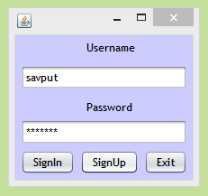
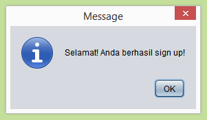
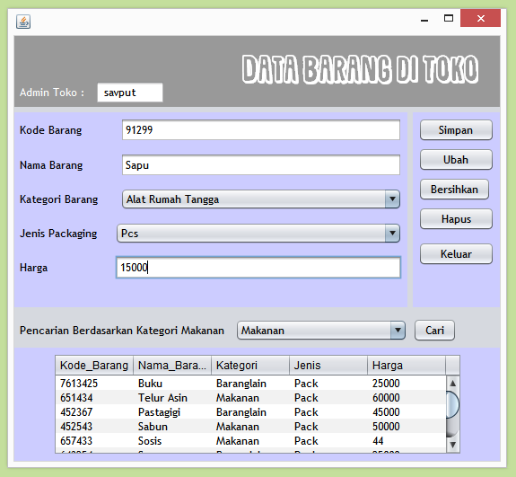
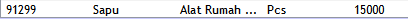
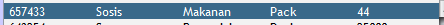
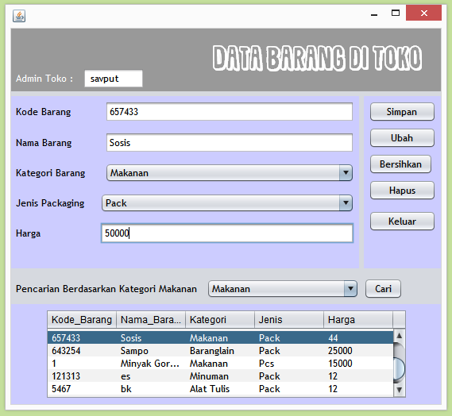
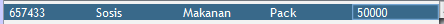
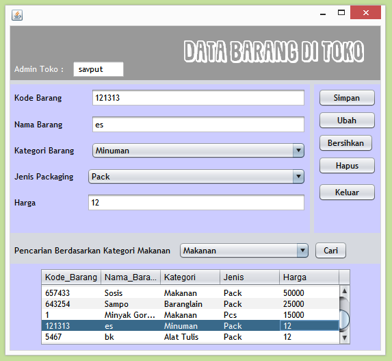
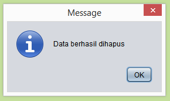
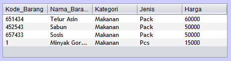

# ContohBarangdiToko-MVC

Nama : Savina Ramadhani Putri T 

Kelas : XIRPL3 - 31 

Nama Sekolah : SMK Telkom Malang

# Screenshoot Hasil Aplikasi

1. Halaman Login

2. Message Berhasil Sign Up

3. Setelah berhasil Sign In, akan masuk ke Frame selanjutnya. Frame utama

4. Kemudian saya akan memasukkan data sapu pada kategori alat rumah tangga. Seperti berikut :

5. Kemudian pada tabel akan masuk data yang kita inputkan tadi.

6. Saya akan merubah isi dari data "Sosis" yang awalnya seperti ini menjadi seperti ini :

awal :

langkah - langkah :

akhir :

7. Kita akan menghapus data "Es". Caranya klik datanya kemudian klik button bersihkan.

8. Message Data Berhasil Dihapus

9. Kemudian saya akan mencari data dengan kategori makanan. Maka akan muncul message seperti ini :

